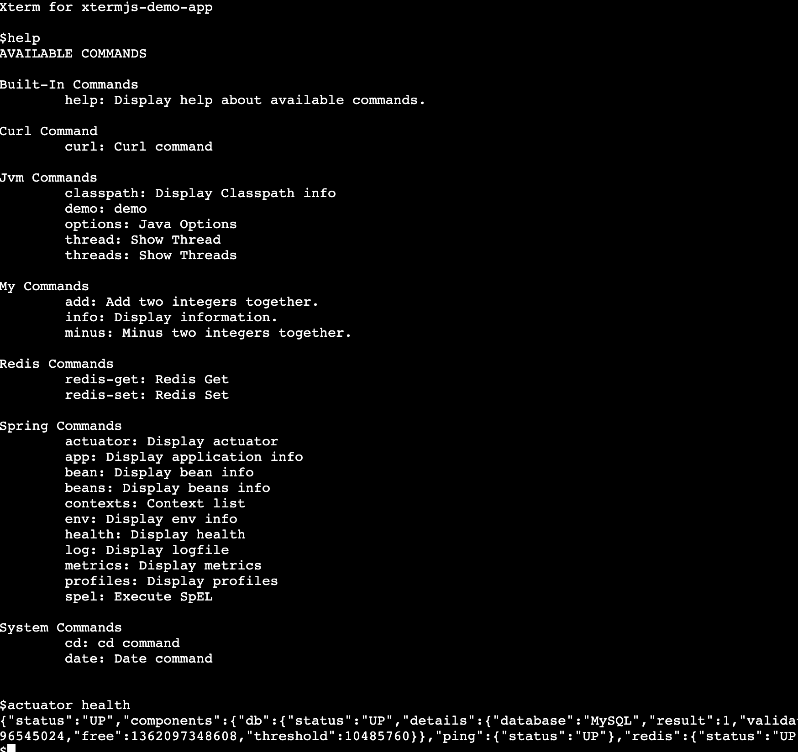

xtermjs-spring-boot-starter
===========================
[](https://travis-ci.com/linux-china/xtermjs-spring-boot-starter)


Supply a web terminal to manage Spring Boot app. Why?

* Access easy: not install, no env setup, just open the browser
* Use commands to manage app
* No need to us curl to call lots of REST API
* Easy to write commands by Spring Shell



**Attention**: You should care about security by yourself.

# How to use?

* Edit pom.xml and add following dependency:

```xml
<dependencies>
    <dependency>
        <groupId>org.mvnsearch</groupId>
        <artifactId>xtermjs-spring-boot-starter</artifactId>
        <version>1.1.0</version>
    </dependency> 
</dependencies> 
```

* Open application.properties and add rsocket configuration.

```properties
# rsocket websocket
spring.rsocket.server.mapping-path=/rsocket
spring.rsocket.server.transport=websocket
```

* Start Spring Boot app and visit http://localhost:8080/xterm


# Terminal Features

* History: arrow up/down
* Ctrl+U: clear input
* clear: clear the screen
* exit: close the window/tab

# Application commands

### System commands

* cd, ls, tree etc  support by ZT Process Executor

### System

* date
* curl: curl command for http operation

### JVM commands

* threads: display threads
* classpath: display classpath

### Spring Commands
* Help: Spring Shell help
* app: display app information
* beans: display all spring beans
* bean: display bean definition
* profiles: display profile
* metrics: display metrics
* health: display health information
* spel: execute SpEL expression 'spel userService.findById(1)'
* actuator: display actuator information

### Commands for Spring Bean

* redis commands
* mysql commands

# How to development

* Start Spring Boot App to supply xterm backend service
* Start "npm run start" to start Webpack dev server for JavaScript development

# References

* Xterm.js Home: https://xtermjs.org/
* Spring Shell Docs: https://docs.spring.io/spring-shell/docs/current/reference/htmlsingle/
* xterm.js + local echo https://www.linkedin.com/pulse/xtermjs-local-echo-ioannis-charalampidis
* How to change the output color of echo in Linux: https://stackoverflow.com/questions/5947742/how-to-change-the-output-color-of-echo-in-linux
